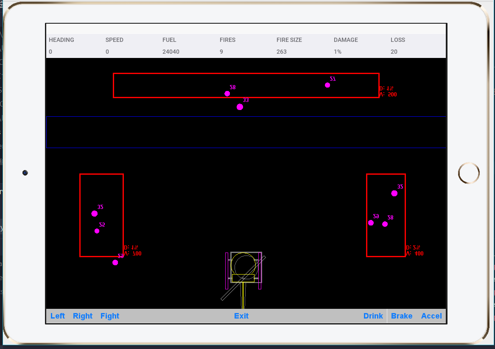

# Helicopter Firefighter Game

https://github.com/user-attachments/assets/ce08cfff-664f-43ac-b58e-b868929b1877

## Codename One Project

This is a multi-module maven project for building a Codename One application. Codename One applications written in Java and/or Kotlin, and are built as native apps and can be built and deployed to iOS, Android, Mac, Windows, Linux, and also to the Web.

## Getting Started

### Java

If you plan to use Java as your primary language, [start here](https://shannah.github.io/cn1-maven-archetypes/cn1app-archetype-tutorial/getting-started.html).

### Kotlin

If you plan to use Kotlin as your primary language, [start here](https://shannah.github.io/cn1app-archetype-kotlin-template/getting-started.html).

## Eclipse Users

IMPORTANT: If you use Eclipse as your IDE, **read this first**

The _tools/eclipse_ directory contains eclipse ".launch" files that will add common Maven goals as menu items inside Eclipse.

**After importing this project into Eclipse, you should import the launch files.**

## NetBeans Users

IMPORTANT: If you use NetBeans as your IDE, **read this first**

The _tools/netbeans_ directory contains netbeans configuration files that are necessary for NetBeans to work properly with this project.

**You should copy these files into the project root directory before opening the project into NetBeans**

This project is a multi-module Maven project that was generated from a Maven archetype.

## IntelliJ Users

The project should work in IntelliJ out of the box. No need to copy any files.

## Help and Support

See the [Codename One Web Site](https://www.codenameone.com).
